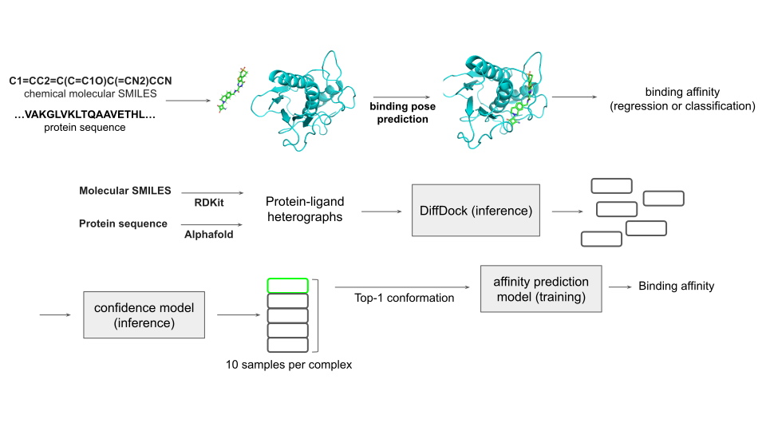
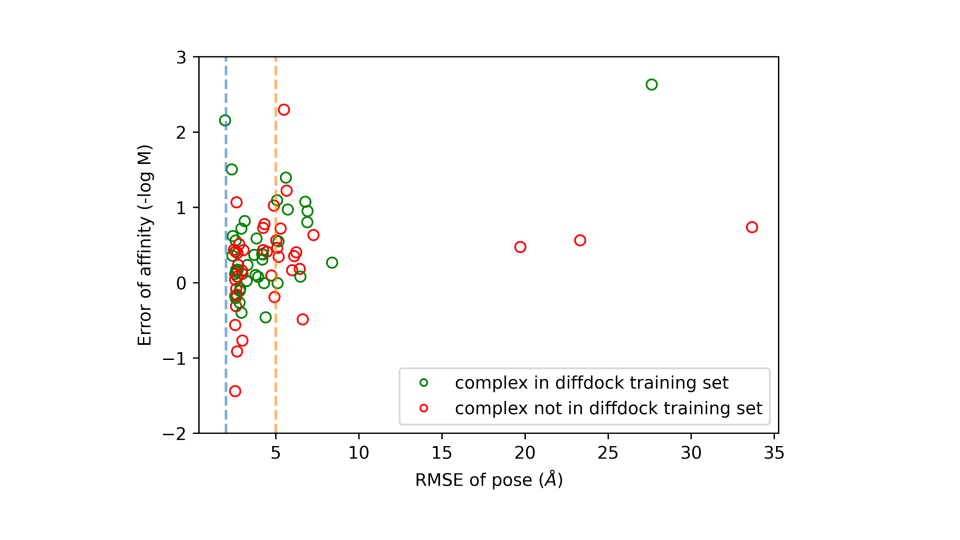
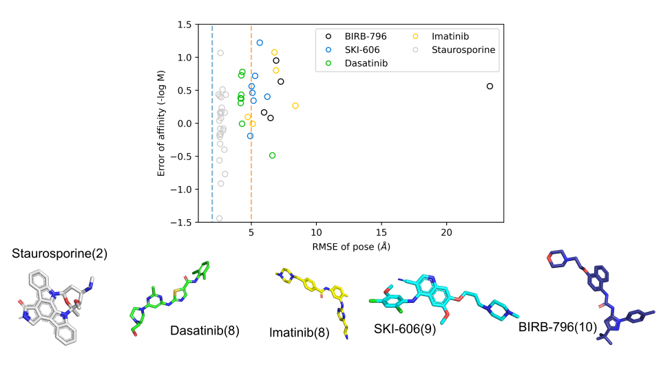

# Modeling three-dimensional protein-ligand structures to predict binding affinities

We utilized DiffDock, a deep learning-based molecular docking approach, to predict protein-ligand binding poses. DiffDock comprises two parts: a conformation diffusion generative model and a confidence score model. The former can sample various binding poses from three-dimensional protein and ligand structures by generating two matrices (translational matrix and rotational matrix) and scalars representing torsion angles of a molecule. On the other hand, the confidence score model evaluates the quality of the binding pose sampled by the generative model. Furthermore, we incorporated another SE(3)-equivariant convolutional graph neural network to predict binding affinity based on bound structures. 

We utilized RDKit, an open-source cheminformatics software, to construct three-dimensional ligand structures from molecular SMILES. For three-dimensional protein structures, we leveraged the AlphaFold Protein Structure Database, where protein folding structures are directly curated through AlphaFold prediction. Both three-dimensional protein and ligand structures were represented as heterogeneous geometric graphs, with nodes representing heavy atoms and edges representing bond types. In order to assess the effectiveness of our methods, we utilized the DAVIS dataset, a well-known benchmark dataset for protein-ligand affinity prediction models. DAVIS comprises 442 proteins, 68 ligands, and 25,772 binding affinity measurements $K_{d}$. However, the truncated $K_{d}$ ($K_{d}$ values are below the limits of the measurement equipment) make up the majority of the DAVIS dataset (around 72%), which leads to challenges in the model training. In the following paragraph, several approaches are discussed to utilize the dataset.

It seems that there is no correlation between deviation of pose and error of affinity prediction.

It seems that ligands with more number of rotatable bonds could lead to higher RMSE of pose.

When poses are between different pockets, the correlation is strong.
When poses are in the same pocket, correlation is not apparent.
